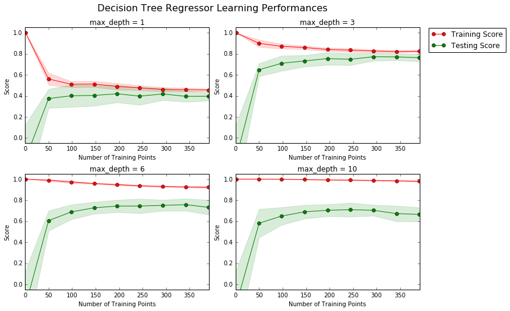
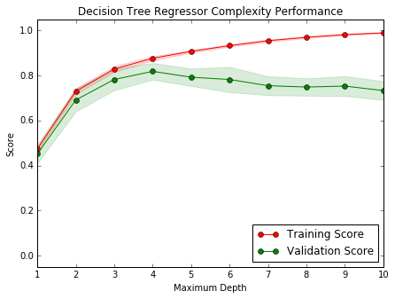

# Machine Learning Project:Predicting-Boston-Housing-Prices 

This project applies  basic machine learning concepts on data collected for housing prices in the Boston, Massachusetts area to predict the selling price of a new home.

**Software and Libraries**

This project uses the following software and Python libraries:

- Python 2.7
- NumPy
- pandas
- matplotlib
- scikit-learn

**Introduction**

The dataset for this project originates from the [UCI Machine Learning Repository](https://archive.ics.uci.edu/ml/datasets/Housing). The Boston housing data was collected in 1978 and each of the 506 entries represent aggregated data about 14 features for homes from various suburbs in Boston, Massachusetts. 
For the purposes of this project, the following preoprocessing steps have been made to the dataset:
- 16 data points have an `'MDEV'` value of 50.0. These data points likely contain **missing or censored values** and have been removed.
- 1 data point has an `'RM'` value of 8.78. This data point can be considered an **outlier** and has been removed.
- The features `'RM'`, `'LSTAT'`, `'PTRATIO'`, and `'MDEV'` are essential. The remaining **non-relevant features** have been excluded.
- The feature `'MDEV'` has been **multiplicatively scaled** to account for 35 years of market inflation.

**Statistics for Boston housing dataset:**

    Minimum price: $105,000.00
    Maximum price: $1,024,800.00
    Mean price: $454,342.94
    Median price $438,900.00
    Standard deviation of prices: $165,171.13
    
**Feature Observation:**

The following behavioral trends are expected from the data:  
-***RM*** - Taking this feature into consideration, out of pure intuition, an increase in the average number of rooms should be going for sale for a higher price, but it need not be necessary that they should hold a linear relationship, other factors could also effect it. So in a general sense higher the number of rooms higher the price of the house but it need not hold good all the time.  
-***LSTAT***- This feature affects the MEDV considering the houses they live are low budget houses and hence when averaged with other houses, it gives out a low MEDV value for that area. So if there was an increase in this percentage which means there would be more such low budget houses, then the MEDV would definitely be affected thereby leaning towards the low end of the range of price of houses in that locality.  
-***PTRATIO***- This feature does not affect the pricing in turn not affecting the MEDV. The intuition behind it would be that if there was an increase in student to teacher ratio all it suggests is that there are more children to teachers in the neighbourhood and don't directly indicate anything at the pricing of houses. But additionally if there was another metric to prove that there was a school in the area which increases its demand and thereby increasing its price, but nothing of that sort is alluded.

**Defining a performance metric**
```python
from sklearn.metrics import r2_score

def performance_metric(y_true, y_predict):
    """ Calculates and returns the performance score between true and predicted values based on the metric chosen. """
    score = r2_score(y_true, y_predict)
    return score
```
**Learning Curves**
We produced four graphs for a decision tree model with different maximum depths. Each graph visualizes the learning curves of the model for both training and testing as the size of the training set is increased. The shaded reigon of a learning curve denotes the uncertainty of that curve (measured as the standard deviation). The model is scored on both the training and testing sets using R<sup>2</sup>, the coefficient of determination.  

```python
vs.ModelLearning(features, prices)
```


**Learning the data:**
If we consider the graph with max_depth =3, the training curve has a negative slope and as more training points are added, the score of the training curve decreases before stabilising at ~0.8. At the same time, adding more training points increases the score of the testing data which undergoes a sharp positive slope in the initial testing points before stabilising at a value of close to ~0.8. At close to 300 points, the two curves converge before diverging slightly. 

From this, it would be safe to assume that 300 training points represents the optimum training-testing trade off.

**Complexity Curves:**

We considered a graph for a decision tree model that has been trained and validated on the training data using different maximum depths. The graph produces two complexity curves — one for training and one for validation. Similar to the **learning curves**, the shaded regions of both the complexity curves denote the uncertainty in those curves, and the model is scored on both the training and validation sets using the `performance_metric` function.  

```python
vs.ModelComplexity(X_train, y_train)
```


**Bias-Variance Tradeoff:**
- Case 1: MAX_DEPTH = 1  
Its a case of high bias. Now a high bias model is a model that is oversimplified which means it works best in cases where there are less features which according to the curses of dimensionality(Bellman) produces less data and thereby ignores the complexity that the model deserves when it comes to considering optimum features. In the graphs above, the training and validation scores are almost converging at max_depth 1. Since the models are oversimplified hence the scores of both the training and validation are not high enough.
- Case 2: MAX_DEPTH = 10   
This is a case of High variance. A high variance model generally suffers from overfitting. In the above graph where the training scores are pretty high at this max_depth as the model trains to be extremely complex but only with respect to the training data leading to overfitting but when we take the validation scores into consideration they don't really give out such a high score.

**Best Guess Optimal Model:**  
max_depth = 3  
The reason behind why I chose this depth is that, the model has pretty high scores both in training and validation and they are kind of converging which means the model works just as good with the test data as it was working with its training data. As the training and testing scores don't differ by a huge margin like the max_depth 10 indicting ovefitting also they aren't consistently low indicating high bias like the max_depth 1

**Fitting a model**
```python
from sklearn.metrics import make_scorer
from sklearn.tree import DecisionTreeRegressor 
from sklearn.grid_search import GridSearchCV

def fit_model(X, y):
    """ Performs grid search over the 'max_depth' parameter for a decision tree regressor trained on the input data [X, y]. """
    cv_sets = ShuffleSplit(X.shape[0], n_iter = 10, test_size = 0.20, random_state = 0)
    regressor = DecisionTreeRegressor()
    params = {"max_depth":range(1,10)}
    scoring_fnc = make_scorer(performance_metric)
    grid = GridSearchCV(regressor, params, scoring_fnc, cv=cv_sets)
    grid = grid.fit(X, y)
    return grid.best_estimator_
```
**Selecting an Optimal Model**
```python
reg = fit_model(X_train, y_train)
print "Parameter 'max_depth' is {} for the optimal model.".format(reg.get_params()['max_depth'])
```
 Parameter 'max_depth' is 4 for the optimal model.

**Predict selling prices and validate using nearest neighbours**
```python
from sklearn.neighbors import NearestNeighbors

import warnings
warnings.filterwarnings("ignore")
# Produce a matrix for client data
client_data = [[5, 34, 15], # Client 1
               [4, 55, 22], # Client 2
               [8, 7, 12]]  # Client 3

# Show predictions
for i, price in enumerate(reg.predict(client_data)):
    print "Predicted selling price for Client {}'s home: ${:,.2f}".format(i+1, price)

num_neighbors=5
def nearest_neighbor_price(x):
    def find_nearest_neighbor_indexes(x, X):
        # x is the vector and X is the data set.
        neigh = NearestNeighbors( num_neighbors )
        neigh.fit(X)
        distance, indexes = neigh.kneighbors( x )
        return indexes
    indexes = find_nearest_neighbor_indexes(x, features)
    sum_prices = []
    for i in indexes:
        sum_prices.append(prices[i])
    neighbor_avg = np.mean(sum_prices)
    return neighbor_avg
```
Predicted selling price for Client 1's home: $339,570.00

Predicted selling price for Client 2's home: $212,223.53

Predicted selling price for Client 3's home: $938,053.85

The predicted 5 nearest neighbors price for Client 1's home is: $315,840.00

The predicted 5 nearest neighbors price for Client 2's home is: $280,980.00

The predicted 5 nearest neighbors price for Client 3's home is: $808,920.00

**Sensitivity**
An optimal model is not necessarily a robust model. Sometimes, a model is either too complex or too simple to sufficiently 
generalize to new data. Sometimes, a model could use a learning algorithm that is not appropriate for the structure of the data given.
Other times, the data itself could be too noisy or contain too few samples to allow a model to adequately capture the target variable — i.e., the model is underfitted. Run the code cell below to run the fit_model function ten times with different training and testing sets to see how the prediction for a specific client changes with the data it's trained on.

```python
vs.PredictTrials(features, prices, fit_model, client_data)
```

-Trial 1: $391,183.33  
-Trial 2: $424,935.00  
-Trial 3: $415,800.00  
-Trial 4: $420,622.22  
-Trial 5: $418,377.27  
-Trial 6: $411,931.58  
-Trial 7: $399,663.16  
-Trial 8: $407,232.00  
-Trial 9: $351,577.61  
-Trial 10: $413,700.00  
 
**Range in prices: $73,357.39**

**Limitations** 
-The data is not that relevant because a lot of things would have changed from 1978 to until now. Because few areas would have become more commercialized than they were in 1978 thereby raising their prices by 10 folds than what they were before
-No, they aren't sufficient features, one of the most important features would be the area which is very key in distinguishing how they are priced.
-From the senstivity test done on the data above. It doesnt seem to be robust yet as the range that is obtained is $73,357.39 which is really odd as no broker would believe in the model since they make their cut off the pricing of the house and if they make more out of its good, but if they make less out of it and if they were to make \$73,000 * (percentage cut) less that would be huge.
-The data definitely cannot be used in a rural city as an urban city is more commercialized. Rural city prices would be way lower.
